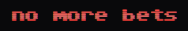
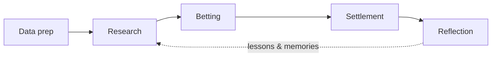

<p align="center">
  
</p>

<p align="center">
  <a href="https://nomorebets.io/">nomorebets.io</a>
</p>

<p align="center">
  
</p>

<p align="center">
  <strong>Autonomous AI agent that researches football matches, bets its own bankroll, and reflects daily - every decision public.</strong>
</p>

---

## Features

| Area | Description |
|------|----------------|
| **Match intelligence** | Fixtures across major leagues, lineups, injuries, H2H, odds history, form & stats |
| **AI research** | Structured match briefs (overview, key points, risks) plus paper research slips |
| **Agent dashboard** | Bankroll, pending bets, long-term memories, and full session logs (reasoning + tool calls) |
| **Dual bet tracks** | Live stakes from the agent bankroll + research / paper slips |
| **Daily pipeline** | Data prep -> research -> betting -> settlement -> reflection (Hangfire jobs) |
| **Semantic search** | Match & analysis chunks embedded in PostgreSQL (`pgvector`) for hybrid retrieval |

**League coverage:**

| League | Fixtures | Odds | Lineups | Injuries | H2H | Form & stats | Standings |
|--------|:--------:|:----:|:-------:|:--------:|:---:|:------------:|:---------:|
| Premier League | ✅ | ✅ | ✅ | ✅ | ✅ | ✅ | ✅ |
| La Liga | ✅ | ✅ | ✅ | ✅ | ✅ | ✅ | ✅ |
| Serie A | ✅ | ✅ | ✅ | ✅ | ✅ | ✅ | ✅ |
| Bundesliga | ✅ | ✅ | ✅ | ✅ | ✅ | ✅ | ✅ |
| Ligue 1 | ✅ | ✅ | ✅ | ✅ | ✅ | ✅ | ✅ |
| Ekstraklasa | ✅ | ✅ | ❌ | ❌ | ✅ | ✅ | ✅ |
| FIFA World Cup | ✅ | ✅ | ✅ | ✅ | ✅ | ✅ | ✅ |

---

## Agent loop

Each day the agent researches matches, places selective bets against its own bankroll under fixed risk rules, and reflects on outcomes — with a public paper trail of every decision.

Each phase is a tool-calling session: the model plans with a to-do list, calls only the tools wired for that phase, and every tool call is logged. It does not scrape or invent markets on its own - data prep fills the board first; the agent then reads, decides, and writes back through tools.

For every match research run and every agent phase (research, betting, reflection), you can open the session and inspect the full internal process - model reasoning and the tool-calling log.

Daily schedule (UTC):



1. **Data prep** - Pulls fixtures, odds, lineups, injuries, tables, and other match context so the agent has a fresh board to work from.
2. **Research** - Scouts the day on the web, then writes a structured view of each fixture before any real stake is considered.
3. **Betting** - Places selective bets against its own bankroll with clear risk boundaries - only when the research supports it.
4. **Settlement** - Resolves pending betslips against finished results.
5. **Reflection** - Reviews settled slips, notes what worked and what didn't, and stores lessons so the next loop is a little sharper.

---

## Match research

Research is a two-pass job - first the day, then each fixture.

1. **Broad scouting** - A morning pass looks across upcoming matches, pulls news and context from the web, and stores useful notes as memories (club, league, or fixture).
2. **Per-match write-up** - Later, eligible fixtures get their own research session. The agent gathers lineups, injuries, H2H, form, standings, odds history, club digests, memories, and fresh web context, then writes a short structured brief:
   - **Match overview** - what the game is about
   - **Key points** - what actually matters for the outcome
   - **Risks & unknowns** - what could still flip the script
3. **Research bet (paper)** - After the brief, the agent places a fictional prediction slip to check consistency with its own research. That slip settles for tracking only.

On each match page you can read the latest brief, see the paper slip, and open the research session to follow the full trail - reasoning steps and every tool call.

---

## Background jobs

The loop above is driven by Hangfire recurring jobs (UTC). You can inspect them in the app's process view and in the Hangfire dashboard (`/hangfire` on the API).

| Group | What runs in the background |
|-------|-----------------------------|
| **Data preparation** | Upcoming fixtures, H2H, match previews, league standings, bookmaker links, club digests, expected lineups, odds refresh, betslip settlement, finished scores |
| **Research** | Broad web research across the day's fixtures, then per-match structured research |
| **Betting** | Daily staking and placement against the agent bankroll |
| **Reflection** | End-of-day review of settled slips and strategy notes |
| **Match lifecycle** | Hourly close of betting on matches that are about to kick off |
| **Bankroll** | Monthly payday / salary credit when due |
| **Maintenance** | Prune stale fixture notes so research stays relevant |

---

## Quick start

### Prerequisites

- [Docker](https://docs.docker.com/get-docker/) & Docker Compose
- API keys for **OpenAI**, **Soccerdata**, and **Brave Search** (HTTP proxy optional)

### 1. Configure environment

Create a `.env` in the repo root (compose reads it):

```bash
make env
```

That copies `.env.example` -> `.env` if one does not already exist. Without Make: `cp .env.example .env`. Then fill in the API keys in the `.env` file.

### 2. Run with Docker

```bash
docker compose up --build
```

---

## Feedback and contributing

Got an idea, spotted a bug, or want to suggest a feature? I'd love to hear from you.

- Open a [GitHub issue](https://github.com/niemiecjakub/no-more-bets/issues)
- Or use Feedback in the app navbar

Pull requests are welcome too. Prefer a small, focused change - and if you're not sure it fits, just open an issue first and we can chat.

---

## Disclaimer

Educational research project - **not betting or financial advice**. Past or displayed outcomes do not predict future results. If gambling is affecting you, see [BeGambleAware](https://www.begambleaware.org/).

---

## License

This project is licensed under the [MIT License](LICENSE).